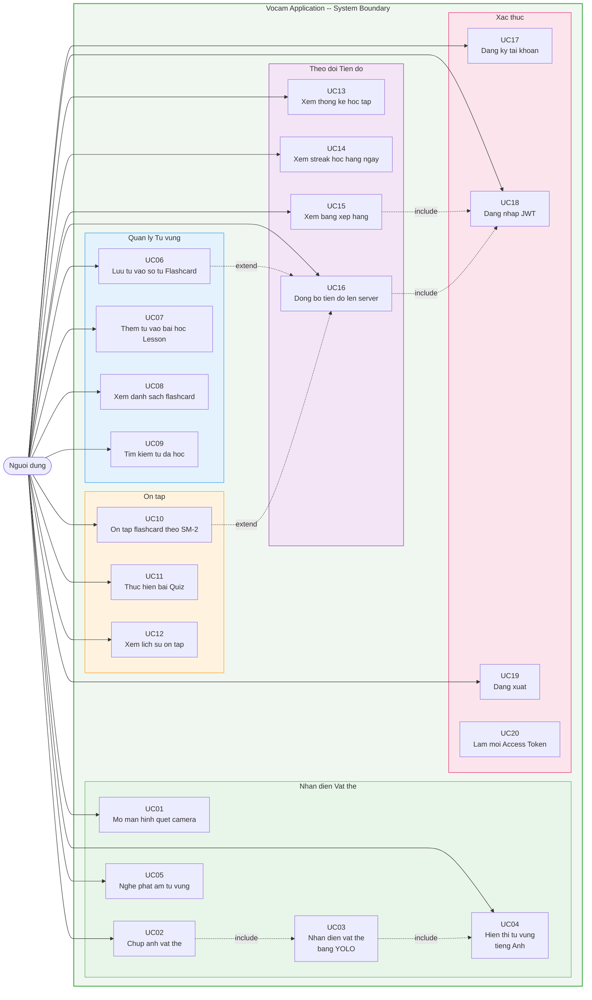
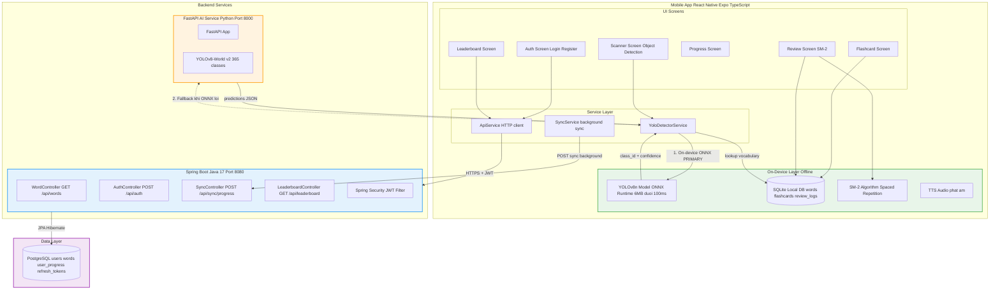
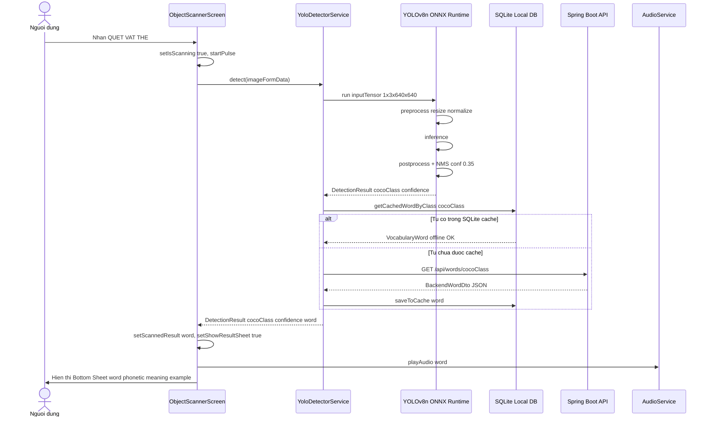
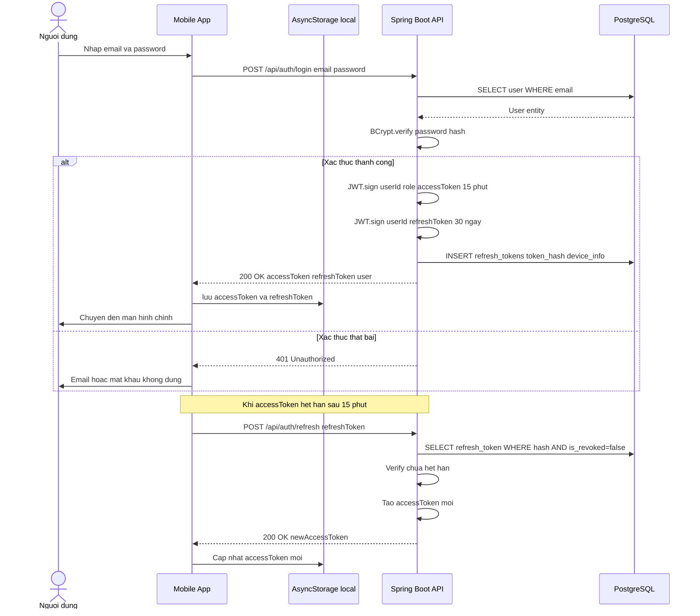
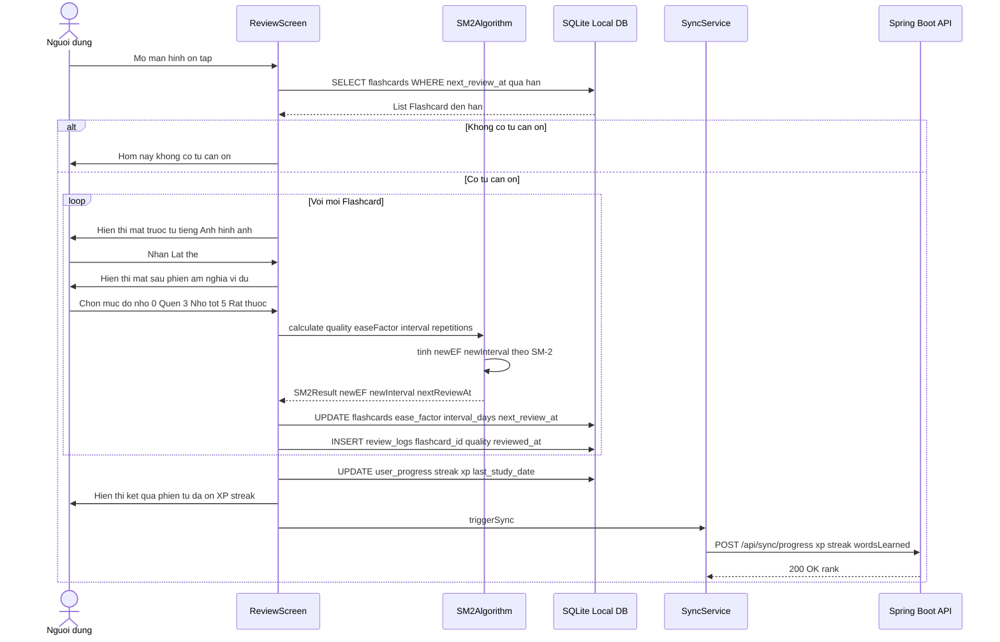
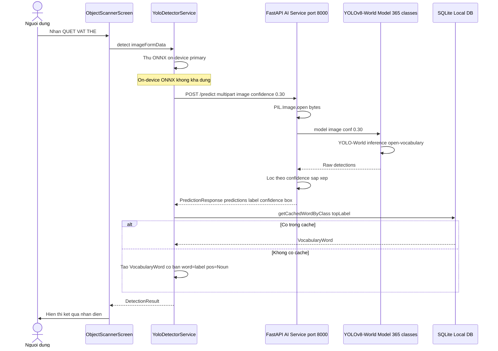
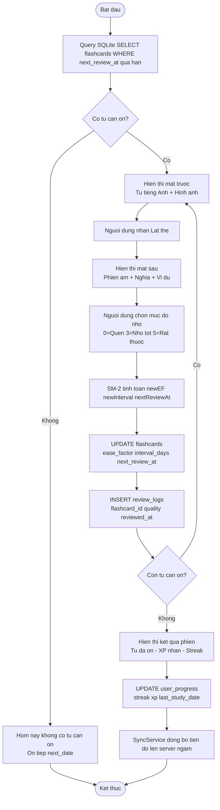
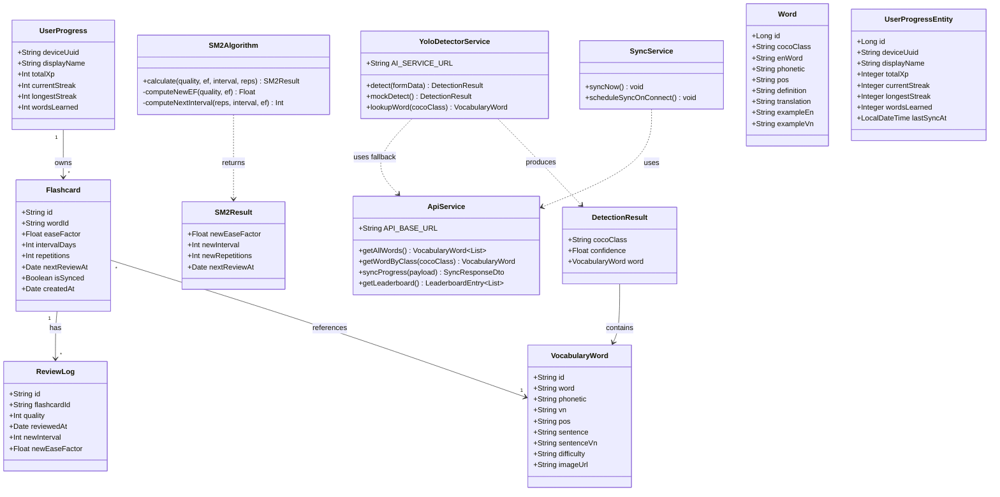
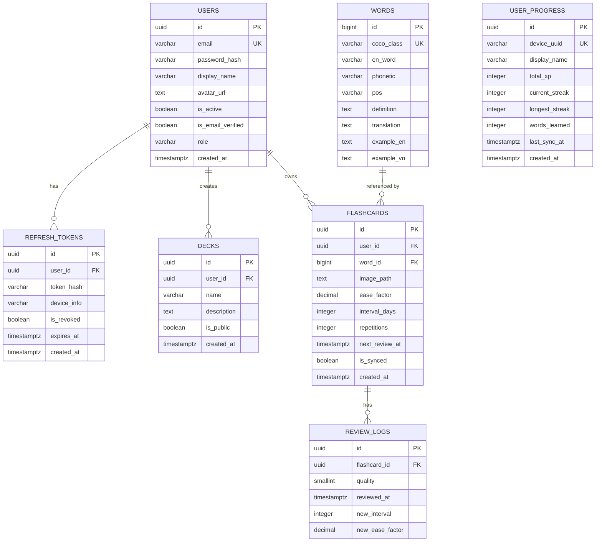
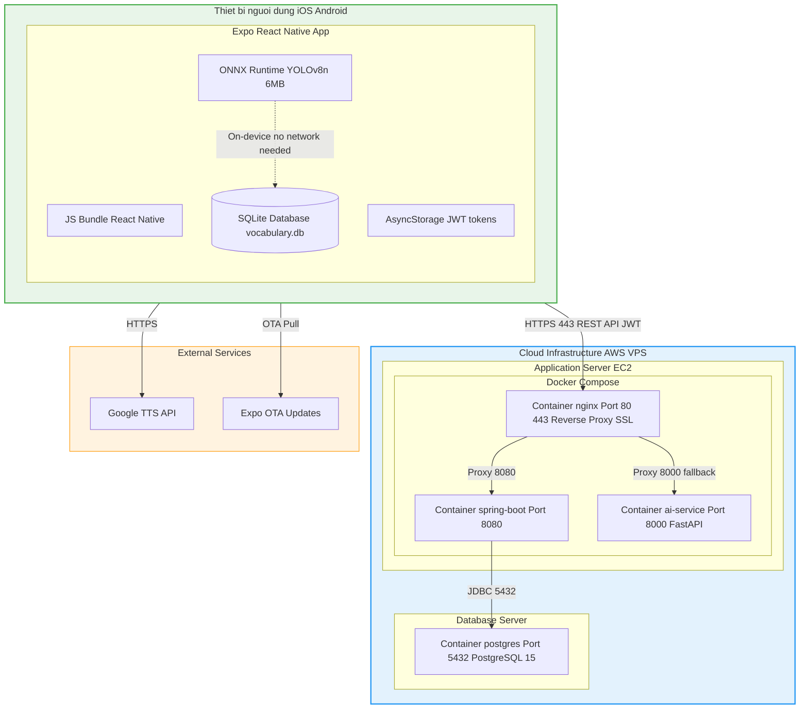

# So do He Thong — Vocam English Learning App

> **Sinh vien:** Tran Tien Anh — MSSV: 22130016
> **De tai:** Nghien cuu va ung dung mo hinh YOLO trong nhan dien vat the ho tro hoc tu vung tieng Anh tren thiet bi di dong
>
> Huong dan xem: Paste tung block mermaid vao https://mermaid.live de xem va tai anh PNG

---

## 1. Use Case Diagram



---


## 2. System Architecture Diagram



---

## 3. Sequence Diagram 1 — Quet va Nhan dien Vat the On-Device



---

## 4. Sequence Diagram 2 — Dang nhap va Xac thuc JWT



---

## 5. Sequence Diagram 3 — On tap Flashcard SM-2



---

## 6. Sequence Diagram 4 — FastAPI Fallback khi ONNX loi



---

## 7. Activity Diagram 1 — Luong Quet va Luu Tu vung

```mermaid
flowchart TD
    START([Bat dau]) --> OPEN[Mo Object Scanner Screen]
    OPEN --> INIT[Khoi tao YOLO ONNX Runtime nap model on-device]
    INIT --> READY{Model kha dung?}

    READY -->|Khong| FALLBACK[Chuyen sang FastAPI AI Microservice mode]
    READY -->|Co| WAIT[Hien thi viewfinder cho nguoi dung]
    FALLBACK --> WAIT

    WAIT --> TAP[Nguoi dung nhan QUET VAT THE]
    TAP --> SCAN[Chup anh tu camera startPulse animation]
    SCAN --> INFER[Chay YOLO inference on-device hoac FastAPI]
    INFER --> DETECT{Phat hien vat the?}

    DETECT -->|Khong| RETRY[Khong nhan dien duoc Thu lai]
    RETRY --> WAIT

    DETECT -->|Co| LOOKUP[Tra cuu tu vung tu SQLite local cache]
    LOOKUP --> CACHED{Co trong cache?}

    CACHED -->|Co| SHOW[Hien thi Bottom Sheet word phonetic meaning example]
    CACHED -->|Khong| FETCH[Goi Spring Boot API GET /api/words/{class}]
    FETCH --> SHOW

    SHOW --> AUDIO[Tu dong phat am TTS Audio]
    AUDIO --> CHOOSE{Nguoi dung chon}

    CHOOSE -->|"Luu vao so tu +15 XP"| SAVE_FLASH[Luu Flashcard vao SQLite\nease=2.5 interval=1 reps=0]
    CHOOSE -->|"Them vao bai hoc"| SAVE_LESSON[Chon Lesson Luu tu vao Lesson]
    CHOOSE -->|Dong| WAIT

    SAVE_FLASH --> XP[Cong 15 XP Hien thi toast]
    SAVE_LESSON --> TOAST[Hien thi Da them vao bai hoc]

    XP --> SYNC_CHECK{Co ket noi Internet?}
    SYNC_CHECK -->|Co| SYNC[SyncService POST /api/sync/progress dong bo ngam]
    SYNC_CHECK -->|Khong| MARK[Danh dau pending_sync Sync lan sau]

    SYNC --> WAIT
    MARK --> WAIT
    TOAST --> WAIT
```

---

## 8. Activity Diagram 2 — Luong On tap SM-2



---

## 9. Class Diagram



---

## 10. ERD — Entity Relationship Diagram



---

## 11. Deployment Diagram



---

## Tom tat cac so do

| # | Ten so do | Loai | Mo ta |
|---|-----------|------|-------|
| 1 | Use Case Diagram | Use Case | 20 use case, 3 tac nhan |
| 2 | System Architecture | Graph | Kien truc 3-tier offline-first |
| 3 | Sequence: Quet vat the | Sequence | YOLO on-device SQLite Bottom Sheet |
| 4 | Sequence: Dang nhap JWT | Sequence | Login + auto refresh token |
| 5 | Sequence: On tap SM-2 | Sequence | Review loop + SM-2 + sync |
| 6 | Sequence: FastAPI Fallback | Sequence | YOLO-World server-side |
| 7 | Activity: Scan va Save | Activity | Luong quet luu flashcard |
| 8 | Activity: SM-2 Review | Activity | Luong on tap day du |
| 9 | Class Diagram | Class | Frontend TypeScript + Backend Java |
| 10 | ERD | ER | Schema PostgreSQL |
| 11 | Deployment Diagram | Deployment | Docker + AWS topology |