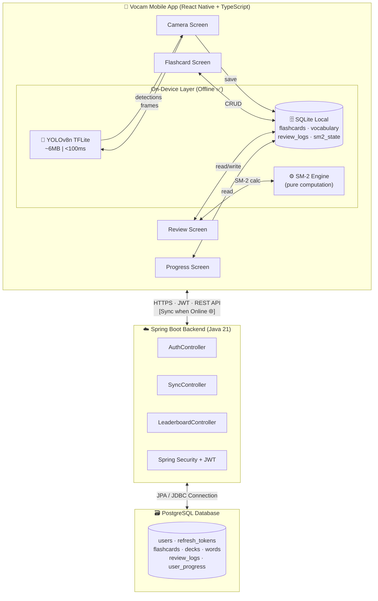
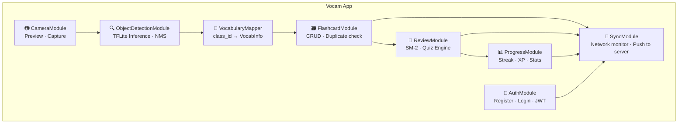
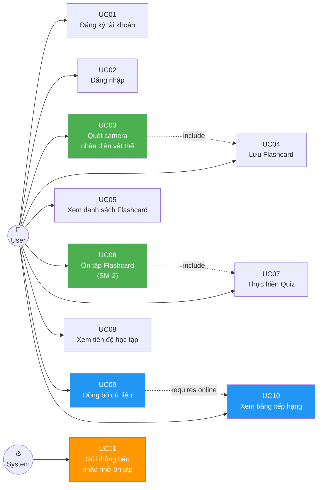
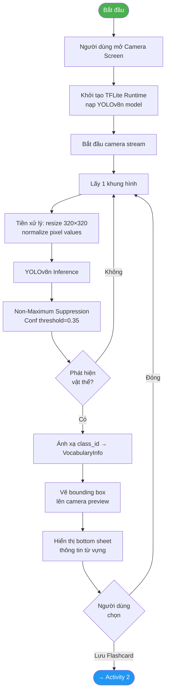
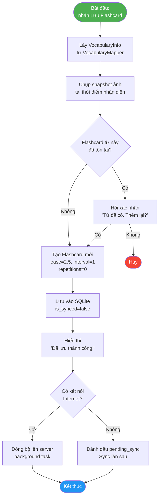
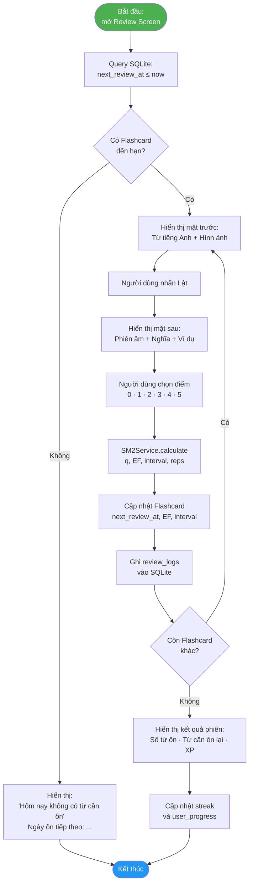
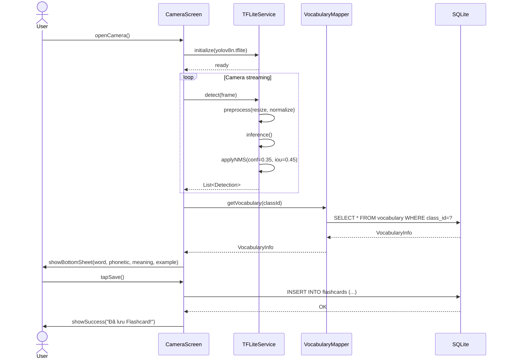
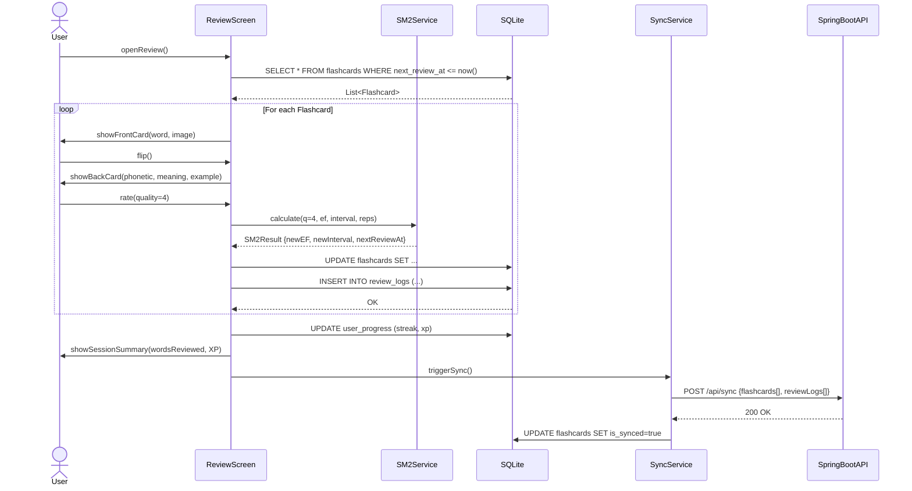
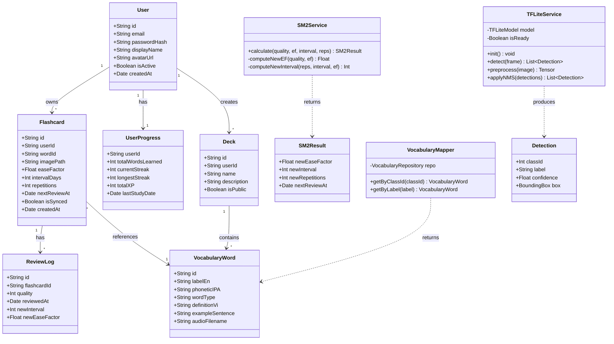

# Kiến trúc Hệ thống Vocam — Tất cả Sơ đồ Mermaid

> Tài liệu chứa toàn bộ các sơ đồ kiến trúc hệ thống cho ứng dụng **Vocam**.
> Bạn có thể render trực tiếp trong VS Code (với extension "Markdown Preview Mermaid Support") hoặc paste vào **https://mermaid.live** để xem/tải ảnh.

---

## 1. High-level Architecture Diagram



---

## 2. Module Architecture Diagram



---

## 3. Use Case Diagram



---

## 4. Activity Diagram 1: Quét và nhận diện vật thể



---

## 5. Activity Diagram 2: Tạo và lưu Flashcard



---

## 6. Activity Diagram 3: Ôn tập theo SM-2



---

## 7. Sequence Diagram 1: Luồng nhận diện vật thể



---

## 8. Sequence Diagram 2: Luồng ôn tập Flashcard



---

## 9. Class Diagram



---

## 10. ERD (Entity Relationship Diagram)

```mermaid
erDiagram
    USERS {
        uuid id PK
        varchar email UK
        varchar password_hash
        varchar display_name
        text avatar_url
        boolean is_active
        boolean is_email_verified
        varchar role
        timestamptz created_at
    }

    DECKS {
        uuid id PK
        uuid user_id FK
        varchar name
        text description
        boolean is_public
        timestamptz created_at
    }

    WORDS {
        uuid id PK
        uuid deck_id FK
        varchar label_en
        varchar phonetic_ipa
        varchar word_type
        text definition_vi
        text example_sentence
        varchar audio_filename
    }

    FLASHCARDS {
        uuid id PK
        uuid user_id FK
        uuid word_id FK
        text image_path
        decimal ease_factor
        integer interval_days
        integer repetitions
        timestamptz next_review_at
        boolean is_synced
        timestamptz created_at
    }

    REVIEW_LOGS {
        uuid id PK
        uuid flashcard_id FK
        smallint quality
        timestamptz reviewed_at
        integer new_interval
        decimal new_ease_factor
    }

    USER_PROGRESS {
        uuid user_id PK_FK
        integer total_words_learned
        integer current_streak
        integer longest_streak
        integer total_xp
        date last_study_date
    }

    REFRESH_TOKENS {
        uuid id PK
        uuid user_id FK
        varchar token_hash
        varchar device_info
        boolean is_revoked
        timestamptz expires_at
    }

    USERS ||--o{ DECKS : "creates"
    DECKS ||--o{ WORDS : "contains"
    USERS ||--o{ FLASHCARDS : "owns"
    WORDS ||--o{ FLASHCARDS : "referenced by"
    FLASHCARDS ||--o{ REVIEW_LOGS : "has"
    USERS ||--|| USER_PROGRESS : "has"
    USERS ||--o{ REFRESH_TOKENS : "has"
```
