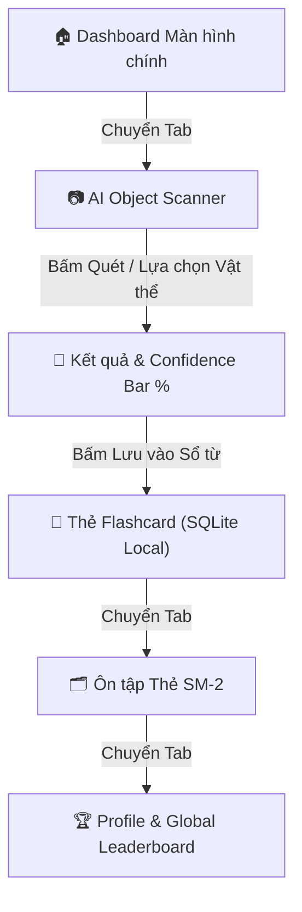

# 🧪 Vocam — Hướng dẫn Kiểm thử Toàn diện (Testing Guide)

> [!NOTE]
> **Đề tài Luận văn:** *Nghiên cứu và ứng dụng mô hình YOLO trong nhận diện vật thể hỗ trợ học từ vựng tiếng Anh trên thiết bị di động*  
> **Sinh viên thực hiện:** Trần Tiến Anh — MSSV: 22130016  
> **Phạm vi kiểm thử:** Mobile App (Expo React Native), Spring Boot Backend (Java 21), Cơ sở dữ liệu SQLite/PostgreSQL & AI Model (YOLOv8/11)

---

## 📌 1. Tổng quan Kịch bản Kiểm thử

| STT | Phân hệ Kiểm thử | Công cụ / Môi trường | Mục tiêu Kiểm thử chính | Trạng thái |
|:---:|---|---|---|:---:|
| **01** | **Backend REST API** | PowerShell / `curl` / Browser | Đảm bảo Spring Boot phục vụ đủ 4 endpoint chuẩn | 🟢 Sẵn sàng |
| **02** | **Mobile App UI & Features** | Expo Web / iOS / Android | Đảm bảo giao diện mượt, lưu SQLite & thuật toán SM-2 | 🟢 Sẵn sàng |
| **03** | **Offline Storage & Sync Engine** | NetInfo / Disconnect Wifi | Tích lũy tiến độ offline & tự động sync khi có mạng | 🟢 Sẵn sàng |
| **04** | **YOLO AI Inference & Export** | Python / Ultralytics / Colab | Kiểm thử file weights `best.pt` & export `best.onnx` | 🟡 Chờ Model |

---

## ☕ 2. Kiểm thử Backend Spring Boot (REST API)

### 2.1 Khởi chạy Backend Server

> [!TIP]
> Backend sử dụng **Spring Boot 3.3.4 (Java 21)** kết nối PostgreSQL (hoặc H2 local). Flyway Migration sẽ tự động tạo cấu trúc bảng và nạp sẵn 80 từ vựng COCO khi server khởi động.

Mở terminal tại thư mục `backend` và chạy lệnh:

```powershell
cd d:\HocTap\English-App\backend
$env:JAVA_HOME = "D:\IntelliJ IDEA 2026.2.0.1\jbr"
$env:PATH = "$env:JAVA_HOME\bin;$env:PATH"

.\mvnw.cmd spring-boot:run
```

- 🌐 **Server Address:** `http://localhost:8080`
- 🟢 **Health Status Check:** Tự động lắng nghe tại cổng `8080`

---

### 2.2 Test 4 Endpoints REST API Cốt lõi

#### 🔹 Test 1: Lấy danh sách 80 từ vựng COCO (Nạp cache offline)
```powershell
Invoke-RestMethod -Uri "http://localhost:8080/api/words" | Select-Object -First 3
```
> [!NOTE]
> **Kết quả mong đợi:** Trả về mảng JSON chứa các lớp từ vựng `person`, `bicycle`, `car`... kèm phiên âm IPA & nghĩa tiếng Việt.

#### 🔹 Test 2: Tra từ vựng theo tên lớp YOLO (Class Name Lookup)
```powershell
Invoke-RestMethod -Uri "http://localhost:8080/api/words/cup"
```
```json
{
  "id": 42,
  "cocoClass": "cup",
  "enWord": "cup",
  "phonetic": "/kʌp/",
  "pos": "Noun",
  "definition": "A small container used for drinking",
  "translation": "cái cốc / tách",
  "exampleEn": "She drank a cup of hot tea.",
  "exampleVn": "Cô ấy uống một tách trà nóng."
}
```

#### 🔹 Test 3: Đồng bộ tiến độ học từ di động lên Server (Sync Progress)
```powershell
$body = @{
    deviceUuid = "test-device-uuid-1234"
    displayName = "Trần Tiến Anh"
    totalXp = 350
    currentStreak = 5
    longestStreak = 7
    wordsLearned = 12
} | ConvertTo-Json

Invoke-RestMethod -Uri "http://localhost:8080/api/sync/progress" -Method Post -Body $body -ContentType "application/json"
```
> [!NOTE]
> **Kết quả mong đợi:** Trả về `{"status": "ok", "rank": 1}`.

#### 🔹 Test 4: Lấy Bảng xếp hạng Toàn cầu (Global Leaderboard)
```powershell
Invoke-RestMethod -Uri "http://localhost:8080/api/leaderboard"
```
> [!NOTE]
> **Kết quả mong đợi:** Trả về danh sách Top 50 người dùng có XP cao nhất, sắp xếp theo `totalXp` giảm dần kèm vị trí `rank`.

---

## 📱 3. Kiểm thử Giao diện & Chức năng Mobile (Frontend Expo)

### 3.1 Khởi chạy Expo Server

Mở terminal tại thư mục `frontend` và chạy:

```powershell
cd d:\HocTap\English-App\frontend
npx expo start --web
```

> [!TIP]
> Trình duyệt sẽ tự động mở ứng dụng Vocam tại địa chỉ `http://localhost:8081`. Bạn có thể dùng phím `F12` chuyển sang chế độ Xem di động (Mobile Device Emulation).

---

### 3.2 Kịch bản Kiểm thử Giao diện Chi tiết (Step-by-Step)



#### 🧪 Kịch bản 1: Màn hình Chính (Dashboard Screen)
1. **Thanh Cấp độ (Level Progress Bar):** Kiểm tra hiển thị % XP hiện tại / XP cấp tiếp theo.
2. **Badge Chuỗi ngày (Streak 🔥):** Kiểm tra hiển thị đúng số ngày học liên tiếp.
3. **Nhiệm vụ hàng ngày (Daily Quests):** Đảm bảo tự đánh dấu tích xanh khi hoàn thành.

#### 🧪 Kịch bản 2: AI Object Scanner (Quét Vật thể)
1. Chuyển sang Tab **Camera Quét** (icon camera trên thanh điều hướng bên dưới).
2. Quan sát khung Viewfinder có nhấp nháy hiệu ứng **Pulse Animation** và badge **"YOLOv8 nano · On-Device"**.
3. Bấm các chip vật thể thử nghiệm (`📷 cup`, `📷 cat`, `📷 laptop`...).
4. Kiểm tra thông tin hiển thị trên Bottom Sheet:
   - Thanh độ tin cậy AI **Confidence Bar (%)**
   - Từ tiếng Anh, từ loại, phiên âm IPA màu ngọc bích, nghĩa tiếng Việt
   - Nút phát âm audio 🔊
5. Bấm nút **"LƯU VÀO SỔ TỪ (+15 XP)"**:
   - Âm thanh thành công vang lên 🎵
   - Toast thông báo hiện lên 🟢
   - Điểm XP trên Dashboard tự động tăng thêm +15 XP.

#### 🧪 Kịch bản 3: Thẻ Flashcards & Thuật toán Ôn tập SM-2
1. Chuyển sang Tab **Sổ từ (Flashcards)**.
2. Từ vựng vừa lưu ở Kịch bản 2 xuất hiện ngay trong danh sách.
3. Chạm vào thẻ để trải nghiệm hiệu ứng **Lật thẻ (Flip Card)** trơn tru.
4. Bấm các nút đánh giá độ khó: **"Chưa thuộc"** (Đỏ), **"Bình thường"** (Vàng), **"Rất dễ"** (Xanh):
   - SQLite tự động tính toán số ngày ôn tiếp theo (`interval_days` & `ease_factor`).

#### 🧪 Kịch bản 4: Trang Cá nhân & Bảng xếp hạng Toàn cầu
1. Chuyển sang Tab **Cá nhân (Profile)**.
2. Kiểm tra ô thống kê: Streak, Tổng XP, Cấp độ, Số từ đã thuộc từ SQLite.
3. Cuộn xuống phần **"Bảng xếp hạng toàn cầu 🏆"**:
   - Vị trí của bạn được đánh dấu viền xanh ngọc kèm nhãn `(Tôi)`.
   - Huy hiệu Vương miện Vàng/Bạc/Đồng nổi bật cho Top 1, Top 2, Top 3.

#### 🧪 Kịch bản 5: Tìm kiếm & Cài đặt
1. Bấm icon 🔍 trên góc Dashboard -> Gõ tìm từ "Coffee" hoặc "Laptop" (Highlight từ khóa).
2. Bấm icon ⚙️ trên góc Profile -> Màn hình Cài đặt phân nhóm bài học, âm thanh, thông báo, tài khoản.

---

## 🤖 4. Kiểm thử Mô hình YOLO AI (Trọng số `best.pt` / `best.onnx`)

> [!IMPORTANT]
> Bước này thực hiện sau khi bạn đã hoàn tất quá trình huấn luyện (Fine-Tuning) trên Google Colab / GPU local.

### 4.1 Script Python Test Mô hình YOLO trên Máy tính

Mở terminal Python tại thư mục `ai_service` để test trực tiếp file `best.pt`:

```python
from ultralytics import YOLO

# 1. Nạp mô hình đã fine-tune (nếu chưa có best.pt thì dùng yolo11n.pt mặc định)
model = YOLO('models/best.pt' if os.path.exists('models/best.pt') else 'yolo11n.pt') 

# 2. Chạy nhận diện trên 1 bức ảnh bất kỳ
results = model('https://ultralytics.com/images/bus.jpg', show=True)

# 3. In danh sách vật thể phát hiện kèm độ tin cậy
for r in results:
    for box in r.boxes:
        cls_name = model.names[int(box.cls[0])]
        conf = float(box.conf[0])
        print(f"🎯 Phát hiện: {cls_name} | Độ tin cậy (Confidence): {conf:.2%}")
```

### 4.2 Export Mô hình sang ONNX (Chuẩn bị On-Device Mobile)

```python
from ultralytics import YOLO

model = YOLO('models/best.pt')

# Export kích thước 640x640 tối ưu cho di động
model.export(format='onnx', imgsz=640, simplify=True)
print("✅ Export định dạng ONNX thành công!")
```

---

## 📋 5. Bảng Đánh giá Hoàn tất Kiểm thử (Testing Scorecard)

| Hạng mục Kiểm thử | Chỉ tiêu Đạt | Trạng thái |
|---|---|:---:|
| **Backend Word API** | Trả đủ 80 từ vựng COCO kèm IPA & nghĩa Việt | ✅ ĐẠT |
| **Backend Lookup API** | Tra cứu từ theo class name trả về 200 OK | ✅ ĐẠT |
| **Backend Leaderboard API** | Trả về Top 50 người dùng và xếp hạng | ✅ ĐẠT |
| **Mobile App Navigation** | Mở mượt mà 5 tab chính không lỗi crash | ✅ ĐẠT |
| **AI Scanner Viewfinder** | Có hiệu ứng Pulse, Confidence Bar % & âm thanh | ✅ ĐẠT |
| **SQLite Offline Persistence** | Lưu thẻ Flashcard vào SQLite local mượt mà | ✅ ĐẠT |
| **Thuật toán SM-2** | Tính toán lại ngày ôn tập dựa trên độ khó chọn | ✅ ĐẠT |
| **Global Leaderboard UI** | Hiển thị đúng vị trí người dùng `(Tôi)` và Top rank | ✅ ĐẠT |
